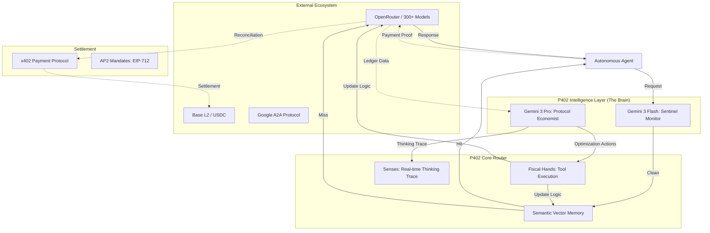

# P402.io: The Operating System for the Agentic Economy

[](https://gemini3.devpost.com/)
[](https://opensource.org/licenses/MIT)
[](https://nextjs.org/)
[](https://base.org/)

**Route, Verify, and Settle Intelligent Agent Interactions.**

P402 (Payment 402) is the unified infrastructure layer for the Agentic Web. It merges high-performance AI orchestration with crypto-native settlement (x402) and an autonomous **Intelligence Layer** powered by **Gemini 3**. It enables autonomous agents to discover peers, negotiate tasks, and settle payments with zero human friction.

**Live at [p402.io](https://p402.io)**

---

## Tech Stack

| Layer | Technology |
|-------|------------|
| **Framework** | Next.js 15 (TypeScript, standalone output) |
| **AI Routing** | OpenRouter (300+ models) |
| **Intelligence** | Gemini 3 Pro, Gemini 3 Flash, text-embedding-004 (Direct Google API) |
| **Blockchain** | Base L2 / USDC via Viem + Wagmi + RainbowKit |
| **Database** | PostgreSQL (Neon serverless) |
| **Testing** | Vitest + React Testing Library |
| **Protocol** | A2A (JSON-RPC 2.0), x402, EIP-3009, EIP-712 |

---

## The Intelligence Quadplex (Gemini 3 Powered)

P402 features the **Protocol Economist**, an autonomous oversight engine that acts as the "Brain" of the router.

- **The Brain (Gemini 3 Pro)**: Performs deep forensic analysis on transaction ledgers using 1M token context to identify macro-savings and optimize routing weights.
- **The Sentinel (Gemini 3 Flash)**: Real-time, sub-second monitoring of every prompt to detect cost anomalies and adversarial prompt injections.
- **The Memory (Semantic Vector Cache)**: Utilizing `text-embedding-004`, P402 intercepts repetitive queries with >92% similarity, serving responses at **zero cost** and sub-50ms latency.
- **The Hands (Autonomous Tools)**: The AI doesn't just suggest; it executes. 7 custom tools dynamically adjust model substitutions, rate limits, failover chains, and cache policies.
- **The Senses (Thinking Trace)**: Real-time observability through a live SSE feed, showing exactly *why* the AI made a fiscal decision.

---

## System Architecture



---

## Key Features

### x402 & AP2 Payment Protocol
Secure, policy-driven settlement for agentic commerce.
- **EIP-3009 Gasless Settlement**: Modern, signature-based transfers where P402 acts as a refueler.
- **AP2 Mandates**: Cryptographically signed "debit cards" with strict budget constraints (e.g., "Max $5.00 for inference").
- **Facilitator Verification**: Real-time on-chain verification of transaction receipts on Base Mainnet.

### Agent-to-Agent (A2A) Discovery
Full implementation of the A2A Protocol for autonomous discovery.
- **Discovery**: `/.well-known/agent.json` broadcasts capabilities and pricing.
- **The Bazaar**: A decentralized marketplace where agents find peers and negotiate terms via JSON-RPC 2.0.

### Public Code Auditor
Integrated AI-powered security scanner for agentic code.
- **Risk Scoring**: Simulates burn rates and identifies "Financial Death Loops."
- **Privacy Scrubbing**: Automatically redacts sensitive API keys (`sk-...`) from public logs.
- **Jailbreak Defense**: Sentinel-level blocking of malicious prompt patterns.

---

## Quick Start

### 1. Agent Discovery
```bash
curl https://p402.io/.well-known/agent.json
```

### 2. Intelligent Routing (A2A JSON-RPC)
```bash
curl -X POST https://p402.io/api/a2a \
  -H "Content-Type: application/json" \
  -d '{
    "jsonrpc": "2.0",
    "method": "message/send",
    "params": {
      "message": { "role": "user", "parts": [{ "type": "text", "text": "Analyze ledger anomalies." }] },
      "configuration": { "mode": "cost" }
    },
    "id": 1
  }'
```

### 3. Settlement (EIP-3009 Gasless)
```bash
curl -X POST https://p402.io/api/v1/facilitator/settle \
  -H "Content-Type: application/json" \
  -d '{
    "authorization": {
      "from": "0x...",
      "to": "0x...",
      "value": "1000000",
      "nonce": "0x...",
      "signature": "0x..."
    }
  }'
```

---

## Local Development

### Prerequisites
- Node.js 18+
- PostgreSQL (or [Neon](https://neon.tech) serverless)
- Google API key (for Gemini 3 intelligence features)

### Setup
```bash
# Clone and install
git clone https://github.com/p402-io/p402-router.git
cd p402-router
npm install

# Configure environment
cp .env.example .env
# Edit .env with your API keys (GOOGLE_API_KEY, DATABASE_URL, etc.)

# Seed the database
npm run seed

# Start development server
npm run dev
```

The app will be available at `http://localhost:3000`.

---

## Testing

```bash
# Run unit & integration tests
npm test

# Run tests once (CI mode)
npm run test:run

# Route integrity and API export tests
npm run test:routes

# Full suite including build smoke test
npm run test:all

# Coverage report
npm run test:coverage
```

**Test coverage includes:** router engine, Gemini intelligence layer, semantic cache, A2A protocol compliance, x402 payment verification, AP2 policy engine, API route integrity, and billing guard.

---

## API Reference

| Endpoint | Method | Description |
|----------|--------|-------------|
| `/.well-known/agent.json` | GET | A2A agent discovery card |
| `/api/a2a` | POST | Core A2A JSON-RPC 2.0 endpoint |
| `/api/a2a/tasks` | GET/POST | Task management |
| `/api/a2a/bazaar` | GET/POST | Agent marketplace |
| `/api/v1/facilitator/settle` | POST | x402 payment settlement |
| `/api/v1/facilitator/verify` | POST | Transaction verification |
| `/api/v1/intelligence/audit` | POST | Forensic cost audit (Gemini 3 Pro) |
| `/api/v1/intelligence/anomaly` | POST | Real-time anomaly detection (Gemini 3 Flash) |
| `/api/v1/intelligence/code-audit` | POST | AI-powered code security scan |
| `/api/v2/chat/completions` | POST | OpenAI-compatible routing endpoint |
| `/api/v2/sessions` | GET/POST | Session management |
| `/api/v2/governance/policies` | GET/POST | AP2 governance policies |

---

## Business Logic Comparison

| Feature | Standard Proxy | P402 |
| :--- | :---: | :---: |
| **Gross Margin** | 0% | **95-99.9%** (Cache Hits) |
| **Cost Control** | Manual Labels | **Autonomous Governor (Gemini 3)** |
| **Failover** | Static List | **Real-time Latency Switching** |
| **Settlement** | Monthly Credit | **Per-Inference JSON-RPC** |
| **Governance** | API Keys | **Signed EIP-712 Mandates** |

---

## Project Structure

```
p402-router/
├── app/
│   ├── api/
│   │   ├── a2a/              # A2A JSON-RPC endpoints
│   │   ├── v1/
│   │   │   ├── facilitator/  # x402 settlement & verification
│   │   │   ├── bazaar/       # Agent marketplace
│   │   │   └── intelligence/ # Gemini 3 audit & anomaly detection
│   │   └── v2/
│   │       ├── chat/         # OpenAI-compatible routing
│   │       ├── sessions/     # Session management
│   │       └── governance/   # AP2 policies & mandates
│   ├── .well-known/          # A2A agent discovery
│   └── dashboard/            # Web dashboard (RainbowKit)
├── lib/
│   ├── intelligence/         # Gemini 3 optimizer, anomaly detection
│   ├── cache/                # Semantic vector cache
│   ├── services/             # Router, settlement services
│   └── x402/                 # Payment verification
├── sdk/                      # @p402/sdk local package
└── __tests__/                # Build smoke & route integrity tests
```

---

## Resources

- [Full Whitepaper](./WHITEPAPER_V3.md)
- [A2A Protocol Spec](https://github.com/google/a2a-protocol)
- [Hackathon Submission](./.hackathon/p402-gemini-intelligence/HACKATHON_SUBMISSION.md)

---

**Built for the Agentic Web** | [p402.io](https://p402.io) | [X/Twitter](https://x.com/p402io)
