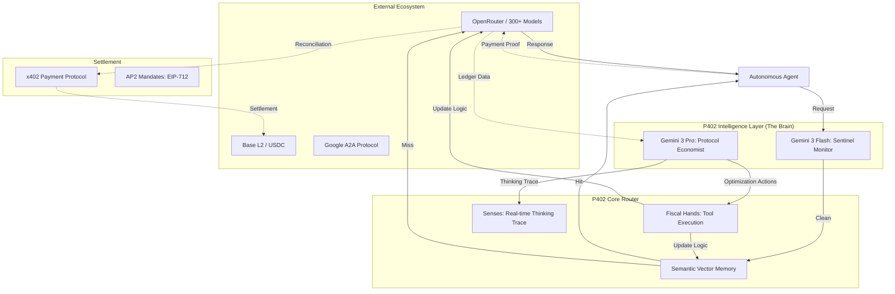

# P402.io: The Operating System for the Agentic Economy

[](https://gemini3.devpost.com/)
[](https://opensource.org/licenses/MIT)

**Route, Verify, and Settle Intelligent Agent Interactions.**

P402 (Payment 402) is the unified infrastructure layer for the Agentic Web. It merges high-performance AI orchestration with crypto-native settlement (x402) and an autonomous **Intelligence Layer** powered by **Gemini 3**. It enables autonomous agents to discover peers, negotiate tasks, and settle payments with zero human friction.

---

## 🧠 The Intelligence Quadplex (Gemini 3 Powered)

P402 v3.0 introduces the **Protocol Economist**, an autonomous oversight engine that acts as the "Brain" of the router.

*   **The Brain (Gemini 3 Pro)**: Performs deep forensic analysis on transaction ledgers to identify macro-savings and optimize routing weights.
*   **The Sentinel (Gemini 3 Flash)**: Real-time, sub-second monitoring of every prompt to detect cost anomalies and adversarial prompt injections.
*   **The Memory (Semantic Vector Cache)**: Utilizing `text-embedding-004`, P402 intercepts repetitive queries with >92% similarity, serving responses at **zero cost** and sub-50ms latency.
*   **The Hands (Autonomous Tools)**: The AI doesn't just suggest; it executes. It dynamically adjusts model substitutions, rate limits, and failover chains.
*   **The Senses (Thinking Trace)**: Real-time observability through a live SSE "Thinking Trace" feed, showing exactly *why* the AI made a fiscal decision.

---

## 🏗️ System Architecture



---

## 🚀 Key Features

### 💳 x402 & AP2 Payment Protocol
Secure, policy-driven settlement for agentic commerce.
- **EIP-3009 Gasless Settlement**: Modern, signature-based transfers where P402 acts as a refueler.
- **AP2 Mandates**: Cryptographically signed "debit cards" with strict budget constraints (e.g., "Max $5.00 for inference").
- **Facilitator Verification**: Real-time on-chain verification of transaction receipts on Base Mainnet.

### 🤖 Agent-to-Agent (A2A) Discovery
Full implementation of the A2A Protocol for autonomous discovery.
- **Discovery**: `/.well-known/agent.json` broadcasts capabilities and pricing.
- **The Bazaar**: A decentralized marketplace where agents find peers and negotiate terms via JSON-RPC 2.0.

### 🛡️ Public Code Auditor
Integrated AI-powered security scanner for agentic code.
- **Risk Scoring**: Simulates burn rates and identifies "Financial Death Loops."
- **Privacy Scrubbing**: Automatically redacts sensitive API keys (`sk-...`) from public logs.
- **Jailbreak Defense**: Sentinel-level blocking of malicious prompt patterns.

---

## 🛠️ Quick Start

### 1. Agent Discovery
```bash
curl https://p402.io/.well-known/agent.json
```

### 2. Intelligent Routing (with Semantic Cache)
```bash
curl -X POST https://p402.io/api/v1/a2a \
  -H "Content-Type: application/json" \
  -d '{
    "jsonrpc": "2.0",
    "method": "message/send",
    "params": {
      "message": { "role": "user", "parts": [{ "type": "text", "text": "Analyze ledger anomalies." }] },
      "configuration": { "mode": "cost" }
    },
    "id": 1
  }'
```

### 3. Settlement (EIP-3009 Gasless)
```bash
curl -X POST https://p402.io/api/v1/facilitator/settle \
  -d '{
    "authorization": {
      "from": "0x...",
      "to": "0x...",
      "value": "1000000",
      "nonce": "0x...",
      "signature": "0x..."
    }
  }'
```

---

## 📊 Business Logic Comparison

| Feature | Standard Proxy | P402 v3.0 |
| :--- | :---: | :---: |
| **Gross Margin** | 0% | **95% - 99.9%** (Cache Hits) |
| **Cost Control** | Manual Labels | **Autonomous Governor (G3)** |
| **Failover** | Static List | **Real-time Latency Switching** |
| **Settlement** | Monthly Credit | **Per-Inference JSON-RPC** |
| **Governance** | API Keys | **Signed EIP-712 Mandates** |

---

## 📚 Resources

- [**Full Whitepaper v3.0**](./WHITEPAPER_V3.md)
- [P402 Documentation](https://p402.io/docs)
- [A2A Protocol Spec](https://github.com/google/a2a-protocol)
- [Hackathon Submission Guide](./.hackathon/p402-gemini-intelligence/HACKATHON_SUBMISSION.md)

---

**Built with 💜 for the Agentic Web** | [p402.io](https://p402.io) | [Twitter](https://twitter.com/p402_io)
