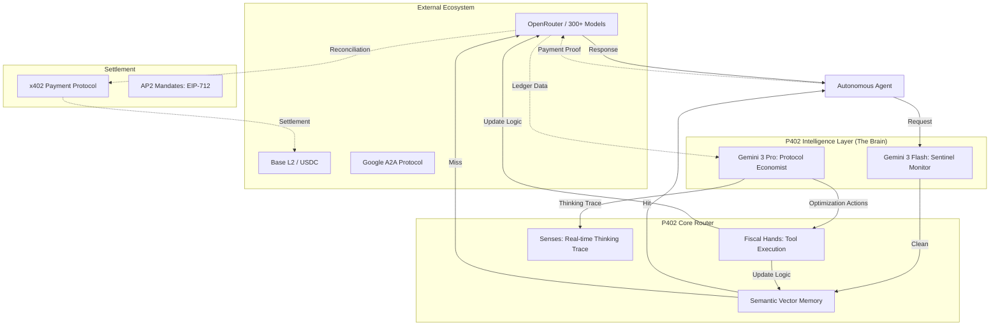

# P402.io: The Operating System for the Agentic Economy
**Whitepaper Version 3.0 (The Intelligence Era)**
**Date:** January 2026
**Repository:** [github.com/Z333Q/p402-router](https://github.com/Z333Q/p402-router)
**Web App:** [p402.io](https://p402.io)

---

## 1. Executive Summary

As the internet undergoes its most significant transformation since the browser—moving from human-centric interaction to **Agent-to-Agent (A2A) commerce**—a critical infrastructure gap has emerged. Autonomous agents, capable of complex reasoning, are currently siloed and operationally fragile. They lack the native infrastructure to settle payments, manage their own "economies," or defend against fiscal "death loops."

**P402.io** provides the unified infrastructure for this new era. Version 3.0 introduces the **Protocol Economist**, an autonomous intelligence layer powered by **Gemini 3**. By merging high-performance LLM orchestration with crypto-native settlement (x402), Google's A2A Protocol, and autonomous fiscal governance, P402 serves as the "Operating System" for the Agentic Web.

---

## 2. The P402 Intelligence Quadplex

P402 v3.0 moves beyond a simple proxy into a self-optimizing organism. We categorize our technical architecture into four interdependent pillars: **The Brain, The Memory, The Hands, and The Senses.**

### 2.1 The Brain (Gemini 3 Intelligence)
At the core of P402 is a dual-model intelligence system that separates *commodity inference* from *protocol reasoning*:
*   **Gemini 3 Pro (The Economist)**: Runs high-thinking analysis over 1M+ tokens of transaction context to identify macro-savings and optimization strategies.
*   **Gemini 3 Flash (The Sentinel)**: Performs real-time, low-latency monitoring of every request, detecting anomalies and adversarial prompt injections before they reach downstream providers.

### 2.2 The Memory (Semantic Vector Cache)
Utilizing `text-embedding-004`, P402 maintains an "Infinite Memory" of agent interactions:
*   **Cost-Intercept**: Before a request hits a provider like OpenAI or Anthropic, P402 performs a vector similarity search (cosine similarity > 0.92). 
*   **Efficiency**: If a match is found, the response is served from the cache, resulting in **zero cost** and sub-50ms latency.

### 2.3 The Hands (Autonomous Tool Execution)
P402 doesn't just suggest optimizations; it executes them. The Economist is equipped with a suite of **Fiscal Hands** to modify the router's behavior in real-time:
*   **`configure_model_substitution`**: Automatically redirects expensive model calls to cheaper, parity-performing alternatives.
*   **`set_model_rate_limit`**: Caps throughput on specific models to stay within tenant budgets.
*   **`configure_failover_chain`**: Dynamically adjusts fallback paths when providers experience latency spikes.

### 2.4 The Senses (Real-Time SSE Thinking Trace)
To prevent the "Black Box" problem, P402 provides full observability. 
*   **Thinking Trace**: A real-time Server-Sent Events (SSE) feed that streams the AI's reasoning process.
*   **Governance Modes**: Tenants can set their agents to **Autonomous** (Full Hands) or **Approval** (Human-in-the-loop for fiscal changes).

---

## 3. High-Level System Architecture



---

## 4. Developer Experience (DX): SDK & API

P402 is designed for "Drop-in Autonomy." Developers can integrate the router without rewriting their agent logic.

### 4.1 The SDK (`@p402/sdk`)
We provide official SDKs for Python and Node.js that wrap standard client definitions. The SDK automatically intercepts `402 Payment Required` errors and handles signing/retry logic transparently.

**Python Initialization:**
```python
from p402.client import AgentClient

client = AgentClient(
    mandate_path="./mandate.json", 
    private_key=os.getenv("AGENT_PRIVATE_KEY")
)

# P402 router chooses optimal model based on Economist policy
response = client.chat.completions.create(
    model="p402/auto",
    messages=[{"role": "user", "content": "Analyze this contract."}],
    p402={"cache": True, "mode": "balanced"}
)
```

### 4.2 API Reference Highlights
*   **`POST /v1/chat/completions`**: The main routing endpoint.
*   **`GET /v1/intelligence/status`**: Check the real-time status of the Quadplex pillars.
*   **`POST /api/a2a`**: Implementation of the Google A2A messaging standard.

---

## 5. Protocols & Standards

### 5.1 x402: The Settlement Rail
P402 implements the **x402 Payment Required** standard. Developers use the **Gasless (EIP-3009)** flow, where P402 acts as the technical refueler.


### 5.2 Google A2A & A2P (Agent-to-Passenger)
P402 is fully compliant with the Google A2A Standard for discovery and negotiation.
*   **Discovery Manifest (`/.well-known/agent.json`)**: Every P402 node publishes a JSON manifest detailing identity, capabilities, and x402 pricing.
*   **A2P Artifacts**: When an agent detects a high-risk fiscal event (e.g., "Spend > $100"), P402 utilizes the **A2P protocol** to generate a "Human in the Loop" Artifact, pushed directly to the user's mobile wallet for biometric approval.

---

## 6. Security & Governance: The Automated Audit

### 6.1 Autonomous Code Audit
Before an agent enters **The Bazaar**, it undergoes a Gemini-powered static analysis.
*   **Pattern Recognition**: Detects known wallet-drainers or inefficient recursive loops.
*   **Privacy Scrubbing**: Automatically redacts sensitive API keys (`sk-...`) from public traces using our proprietary regex-scrubbing engine.
*   **Audit Badges**: Verified agents receive an **EAS (Ethereum Attestation Service)** credential attached to their DID.

### 6.2 AP2 Mandates: The Governance Logic Gate
Agents operate under cryptographically signed policy objects (EIP-712).


---

## 7. Business Logic & User Stories

### A. The "Infinite Loop" Safeguard (Enterprise CTO)
**Scenario**: A Customer Support Agent gets stuck in a loop thanking a customer, burning API credits.
**P402 Solution**: The agent operates under a Mandate with a `$50/day` cap. At `$50.01`, the **Sentinel** rejects the request and fires an SSE alert to the CTO's dashboard.

### B. The "IP Licensing Scout" (GenAI Lab)
**Scenario**: A lab needs verified medical datasets but must ensure a legal audit trail.
**P402 Solution**:
*   **Micro-Payments**: The lab's Scout agent finds a PDF and pays a micro-fee ($0.05) via x402.
*   **Attestation**: The transaction hash includes a cryptographic attestation of legal acquisition, verified by the P402 **Protocol Economist**.

---

## 8. Financial Scaling & Unit Economics

### 8.1 The "Intelligence Margin" (Semantic Flywheel)
P402 turns AI orchestration into a high-margin business.
*   **Scenario A (Cache Hit)**: Margin of **~99.9%** by serving responses from the Semantic Vector Memory ($0.0001 cost).
*   **Scenario B (Substitution)**: Margin of **~95%** by autonomously downgrading simple tasks to Gemini 3 Flash.

#### Diagram 6: The Margin Expansion Flywheel


---

## 9. Roadmap: The Path to $100M ARR

*   **Q1 2026 (Completed)**: Intelligence Layer Integration (The Quadplex).
*   **Q2 2026**: The Bazaar Public Launch & EAS Reputation Attestations.
*   **Q3 2026**: Decentralized Edge Nodes (WASM-based local routing).
*   **Q4 2026**: Global A2P integration within Coinbase Wallet.

---

## 10. Conclusion

P402.io is the infrastructure of the Agentic Web. By merging **The Brain** (Gemini 3) with **The Hands** (Autonomous Tools) and **The Rail** (x402/Base), we enable a future where intelligent agents are self-sustaining economic actors.

The future is Agentic. P402 is how they do business.
