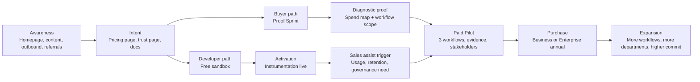

# P402 Pricing Strategy and Conversion Funnel Plan

## Executive summary

P402 should price and sell as **AI spend accountability and governance software**, not as a protocol, a generic observability add-on, or a savings engine. The strongest market pattern across the closest comparables is consistent: developer entry is usually free or very low-friction, the primary commercial meter is usage rather than seats alone, higher tiers gate retention, RBAC, SSO, and support, and enterprise pricing becomes consultative and contract-led. That pattern shows up across Sentry, New Relic, Braintrust, Langfuse, Helicone, LaunchDarkly, Portkey, and PostHog, while the FinOps-style analogs such as CloudZero and Kubecost skew even more strongly toward custom enterprise packaging. citeturn2view0turn2view1turn2view2turn2view3turn4view0turn4view1turn7view0turn16view0turn10view3turn6view3

For P402, the best fit is a **hybrid architecture** with a free sandbox inside the Developer motion, a paid Developer plan, a clearly priced Business plan, and a custom Enterprise plan, plus two high-touch commercial offers ahead of annual purchase: a **Proof Sprint** and a **Paid Pilot**. The primary billable metric should remain **metered AI events**, because it is legible, operationally native to the product, and much closer to the way the best comparable products monetize than seats-only pricing. New Relic bills on data ingest, users, and compute; LaunchDarkly bills on service connections, MAU, and AI runs; Langfuse bills on units; Helicone on requests and storage; Portkey on recorded logs/requests; Braintrust on processed data and scores. citeturn3view0turn3view1turn3view2turn5view2turn5view3turn17view3turn4view0turn7view0turn8view0

The pricing recommendation in this report is:

| Offer | Recommended public price | Recommended inclusion | Recommended role in funnel |
|---|---:|---:|---|
| Sandbox | $0 | 25k metered AI events/month | Dev trial + docs conversion |
| Developer | $99/month | 250k events/month | PLG paid entry |
| Business | $1,500/month annual or $1,800 month-to-month | 5M events/month | Team/department expansion |
| Enterprise | Starting at $60k ARR, custom | 25M+ annual event commit, custom terms | Procurement-led purchase |
| Proof Sprint | $7,500 | 14 days, 1 workflow | Paid diagnostic and conversion bridge |
| Paid Pilot | $25k standard / $40k regulated-complexity | 60–90 days, 3 workflows | Purchase bridge to annual |

The reason to **avoid pricing on savings today** is not philosophical; it is commercial discipline. Your own internal context points to the same conclusion: the technical spine is strong, but proof density is still thin, outcome volume and reference evidence are not yet where they need to be, and enterprise trust has to be earned with packaging, proof, and polished buyer surfaces before performance-fee positioning makes sense. fileciteturn0file0 fileciteturn0file1 fileciteturn0file2

## Market evidence and competitive benchmark

The market does **not** support a high-friction, sales-only entry point for products in P402’s neighborhood. Sentry offers a free plan, then Team at $26/month and Business at $80/month before custom Enterprise, with usage dimensions across errors, logs, metrics, spans, and replays. New Relic offers a free tier, then usage by ingest volume and users. Braintrust offers Starter free and Pro at $249/month. Langfuse offers Hobby free, Core at $29/month, Pro at $199/month, and Enterprise at $2,499/month. Helicone offers Hobby free, Pro at $79/month, Team at $799/month, then custom Enterprise. LaunchDarkly supports a free developer tier and then usage-based Foundation pricing with service connections, MAU, and AI runs. Portkey offers free developer entry, a $49/month Production plan, and custom Enterprise. PostHog also follows a generous free tier plus usage-based expansion model. citeturn9view4turn3view0turn8view0turn17view3turn4view0turn5view3turn7view0turn16view0

At the enterprise end of the market, the strongest analogs to P402 are closer to **cost governance** than to tracing alone. CloudZero explicitly positions itself as a “financial control plane for AI economics,” sells a single subscription aligned to customer scale and complexity, and includes unlimited users, dimensions, dashboards, telemetry, optimization recommendations, anomaly detection, and multi-year retention. Kubecost likewise gives away a free base product and pushes larger teams to enterprise packaging around scale, retention, RBAC, and support. citeturn10view3turn10view1turn6view3

That means P402’s commercial structure should do two things at once. It should match **developer tool buying behavior** on the way in, and **governance / FinOps buying behavior** on the way up. If P402 starts self-serve pricing too high, it will compare poorly to Langfuse, Helicone, Portkey, and Sentry. If it stays too cheap at the enterprise end, it will underprice the governance value buyers actually care about. citeturn17view3turn4view0turn7view0turn9view4turn10view3

### Competitive comparison table

| Company | Category | Public starter price | Mid-tier price | Enterprise entry ARR | Primary usage metric | Pilot / POC offering | Notable packaging tactics | Sources |
|---|---|---:|---:|---:|---|---|---|---|
| Sentry | Developer observability | Free | Team $26/mo; Business $80/mo | Unspecified custom | Errors, logs GB, metrics GB, spans, replays | Free plan, trials, demo | Free entry + pay-as-you-grow data dimensions + SAML/SCIM at Business | citeturn9view4turn9view2turn9view1 |
| New Relic | Observability / FinOps-adjacent | Free | Standard $0.40/GB + user charges; Pro $349/full platform user annually | Unspecified custom | Data ingest GB, users, CCUs | Free tier; self-serve standard/pro | Transparent usage billing across ingest, users, and compute | citeturn3view0turn3view1turn3view2 |
| Braintrust | AI observability / evals | Starter $0/mo | Pro $249/mo | Unspecified custom | Processed data GB, scores, token-based Topics | Free starter, no credit card | Strong “free instrumentation, pay when scaling” motion; retention/RBAC/export gated upward | citeturn8view0turn8view1turn8view3 |
| Langfuse | AI observability / tracing | Hobby free | Core $29/mo; Pro $199/mo | Public Enterprise $2,499/mo ≈ $29,988 ARR | Units/month | Free plan explicitly for hobby projects and POCs | Transparent unit pricing + enterprise add-ons for SSO/RBAC/support | citeturn17view3turn17view2turn17view0 |
| Helicone | AI gateway / observability | Hobby free | Pro $79/mo; Team $799/mo | Unspecified custom | Requests, storage, retention, orgs | Free plan + 7-day free trial | Strong calculator-led pricing, clear usage-based overages, enterprise security gated up | citeturn4view0 |
| LaunchDarkly | Feature control / AI governance | Developer $0/mo | Foundation usage-based: $10/service connection, $8.33 per 1k client-side MAU, $5 per 1k AI runs past 5k | Unspecified custom | Service connections, MAU, AI runs | Free tier + free trial | Excellent example of control-plane pricing with multiple value metrics | citeturn5view3turn5view2turn5view1 |
| CloudZero | FinOps / AI economics | No public starter | Custom only | Unspecified custom | Scale/complexity, not publicly itemized | Demo / tour | Single-subscription enterprise packaging with unlimited users/dimensions and bundled governance | citeturn10view3turn10view1 |
| Portkey | AI gateway / control plane | Developer free | Production $49/mo | Unspecified custom | Recorded logs / requests | Free developer plan explicitly suitable for evaluating POCs | Low-friction production tier + clear overages + enterprise governance controls | citeturn7view0 |
| Kubecost | K8s cost governance | Foundations free | No public mid-tier | Unspecified custom | Scale by clusters / cores / retention, not public rate card | Free install | “Always free” base deployment plus enterprise for retention, RBAC, multi-cluster scale | citeturn6view3 |
| PostHog | Product analytics / experimentation / AI observability | Free | Usage-based after free tiers | Unspecified enterprise sales motion | Events, requests, exceptions, AI observability events | Free signup | Transparent free tier + product-by-product usage billing + spend caps | citeturn16view0 |

### What this validates for P402

The evidence validates five commercial decisions.

First, **P402 should have a free sandbox**. Too many close comparables use free entry for P402 to insist on paid-only developer onboarding without harming docs and bottoms-up conversion. citeturn9view4turn3view0turn8view0turn17view3turn4view0turn5view4turn7view0turn16view0

Second, **P402 should keep usage as the primary billable metric**. The market already trains buyers to accept usage-driven pricing when the metric is operationally legible. P402’s cheapest mistake would be to force everything into seats when the product’s real value comes from metered AI activity, governance evidence, and workflow attribution. citeturn3view0turn5view2turn5view3turn17view3turn4view0turn7view0

Third, **P402 should not publicly present as a cheap tracing tool**. The market already has multiple low-cost AI observability products. P402’s edge is governance, attribution, controls, and outcome linkage; the Developer plan should be accessible, but the Business and Enterprise plans should be unmistakably more serious. citeturn17view3turn4view0turn7view0turn10view3

Fourth, **security, retention, export, and procurement features belong higher in the ladder**. That is nearly universal in the comparison set. citeturn9view2turn8view1turn17view3turn4view0turn5view1turn7view0

Fifth, **a consultative pilot layer is justified**. CloudZero, LaunchDarkly Enterprise, Braintrust Enterprise, and Kubecost Enterprise all rely on higher-touch enterprise motions; P402’s Proof Sprint and Paid Pilot fit that pattern, but should be more structured and public than vague “contact us for enterprise.” citeturn10view3turn5view1turn8view1turn6view3

## Recommended P402 pricing architecture

### Target ICPs and buyer personas

P402 should run a **dual-lane GTM**: a developer lane for adoption and a governance lane for expansion.

| Segment | Ideal customer profile | Typical scale | Main pain | Primary buyer | Likely close motion |
|---|---|---|---|---|---|
| Developer | AI app builder, small product team, consultancy pod | <500k metered AI events/month | Need visibility into request cost, outcomes, and basic attribution | Engineering lead / ML engineer | Self-serve or light sales |
| Business | AI product team, operations team, mid-market SaaS, internal AI platform team | 500k–10M events/month | Need workflow-level accountability, shadow controls, exports, and team governance | Director of engineering, platform lead, AI operations leader | Sales-assisted |
| Enterprise | Regulated firm, large SaaS, public-sector / healthcare / finance workloads, multi-BU AI deployment | 10M+ events/month or multi-team rollout | Need procurement-safe AI spend accountability with SSO, RBAC, retention, DPA/BAA/SLA, and rollout support | VP Eng / FinOps lead / CIO org / procurement sponsor | Pilot to annual enterprise contract |

P402’s buyer personas should map as follows. The **technical champion** is usually an engineering/platform/ML owner who wants instrumentation and proof. The **economic buyer** is usually an engineering leader, cloud cost owner, or finance-facing infra leader who wants accountability, forecasting, and governance. The **control buyer** is security, compliance, or procurement, who wants data-handling clarity, SSO/RBAC, retention policy, and contract structure. This is closer to CloudZero and LaunchDarkly than to pure tracing-only tools. citeturn10view3turn10view1turn5view1turn5view2

### Recommended final pricing and packaging

### Core product offers

| Offer | Audience | Public price | Included usage | Overage | Included capabilities | Exclusions / limits |
|---|---|---:|---:|---:|---|---|
| Sandbox | Developers evaluating P402 | $0 | 25k metered AI events/month | None; recording pauses or nags at cap | Meter, Monitor basics, basic outcomes API, 14-day retention, 2 users, 1 project/tenant, community support | No shadow controls, no audit exports, no SSO/RBAC, no enterprise support |
| Developer | Production-ready small teams | $99/month | 250k events/month | $0.25 per 1k events | All Sandbox + 90-day retention, unlimited users, API export, outcome coverage, email support | No SSO, no advanced RBAC, no procurement pack |
| Business | Department or multi-workflow team | $1,500/month annual or $1,800 month-to-month | 5M events/month | $0.12 per 1k events | All Developer + 1-year retention, shadow controls, audit exports, team roles, shared Slack/email support, success review cadence | No custom contract language beyond standard order form/DPA, no custom BAA unless added |
| Enterprise | Procurement-led or regulated buyers | Starting at $60k ARR, annual only | 25M+ annual event commit, custom allocation | Custom committed rate card | All Business + SSO/SAML, SCIM, fine-grained RBAC, custom retention, DPA/BAA options, SLA, security review support, procurement pack, optional private deployment design | Custom-priced, sales-led |

This structure deliberately places P402 **above commodity AI tracing on price, but below major enterprise governance platforms on initial ACV**, which is the right place for the current product maturity. Langfuse’s paid cloud plans begin at $29 and $199, Helicone’s paid tiers at $79 and $799, Portkey’s at $49, Braintrust’s paid tier at $249, and LaunchDarkly’s Foundation plan scales quickly with service connections/MAU/AI runs. That supports a $99 Developer price and a $1.5k starting Business price if P402 clearly packages governance and accountability rather than just traces. citeturn17view3turn4view0turn7view0turn8view0turn5view3

The **Enterprise floor should not be less than $60k ARR** unless a logo is strategically important, because once SSO, procurement, security review, contract review, audit exports, and stakeholder support begin, the sale behaves much more like LaunchDarkly / CloudZero / Kubecost enterprise software than like a low-cost developer plug-in. citeturn5view1turn10view3turn6view3

### Commercial bridge offers

| Offer | Price | Scope | Goal | Credit policy |
|---|---:|---|---|---|
| Proof Sprint | $7,500 | 14 days, 1 workflow, 1 integration path, 1 buyer team | Produce spend map, instrumentation health, and initial outcome coverage plan | 100% credit to Paid Pilot if signed within 30 days |
| Paid Pilot | $25,000 standard / $40,000 regulated-complexity | 60–90 days, up to 3 workflows, security + procurement handling | Prove multi-workflow accountability, outcome coverage, shadow policy evidence, and expansion case | 50% credit to annual contract if signed within 30 days of pilot close |

The **Proof Sprint** is critical because it gives consulting/governance buyers a low-risk paid entry point while preserving value. The **Paid Pilot** should remain the main bridge to annual enterprise contracts. CloudZero’s page is especially instructive here: it does not pretend this is a low-touch PLG-only sale; it invites demo/tour and anchors on business value and platform breadth. citeturn10view3

### How to define the billable metric

The pricing metric should be defined contractually as follows:

> **Metered AI event**: one unique provider-bound or policy-evaluated AI request event that P402 records for a customer tenant within the billing period.

Operational rules should be explicit in the order form and usage docs:

- Count when a unique canonical event is written with a stable event ID for a provider call or a policy-evaluated blocked attempt.
- Count retries as separate billable events if they are distinct attempts with distinct event IDs.
- Do **not** count duplicate replays of the same event ID.
- Do **not** count dashboard views, exports, outcome-only writes, support actions, or internal/system heartbeats.
- Exclude internal/test tenants from billing.
- Publish current usage in-product with included amount, current month consumed, projected month-end, and overage estimate.
- Trigger alerts at 70%, 90%, 100%, and 110% of included usage.
- Offer optional hard caps for self-serve plans and soft caps for enterprise.

This is the part that must feel enterprise-safe. Stripe’s current guidance is useful here: for new usage-based implementations, it recommends Metronome over basic billing meters specifically when you need enterprise contracts, commits, prepaid credits, dimensional pricing, and real-time usage visibility. citeturn14view0turn14view2turn14view3

### Billing, invoicing, and contract terms

Recommended commercial mechanics:

| Topic | Recommendation |
|---|---|
| Sandbox | Free, no card, auto-throttle or recording cap at limit |
| Developer | Card required, monthly self-serve, instant upgrade, downgrade next cycle |
| Business | Annual preferred; monthly available at ~20% premium |
| Enterprise | Annual only; invoice / ACH / wire; Net 30 |
| Proof Sprint | 100% upfront |
| Paid Pilot | 50% at signature, 50% at kickoff or day 30 |
| Usage close | Monthly, UTC calendar month, 72-hour late-arrival settlement window |
| Invoice adjustments | Late events after settlement roll into next invoice as debit/credit line |
| Price protection | Annual customers keep rate until renewal unless contract says otherwise |
| Overage protection | Alerts plus optional hard caps; no surprise overages |

### Legal and compliance notes

Do not use customer logos, named testimonials, or pilot claims without explicit permission. The FTC’s business guidance on endorsements, reviews, and disclosures makes clear that brands should avoid deceptive or unsupported endorsement use, and that material relationships and review integrity matter. For P402 this means two concrete rules: no implied customer claim without permission, and no “savings” testimonial without a documented baseline, methodology, and approval. citeturn15view0turn15view4

For paid business and enterprise plans, the commercial document stack should be:

- Order form
- MSA
- DPA
- Security exhibit
- Pilot SOW where applicable
- BAA only when the use case actually requires it
- Usage metric definition appendix
- SLA only for Enterprise

The metric appendix matters as much as the price itself. It should define counting logic, exclusions, disputed usage windows, correction handling, timezone, rounding policy, and alerting policy. Stripe’s usage-billing guidance reinforces that enterprise usage models get harder when you need transparent, real-time, dimensional billing and contract complexity. citeturn14view0turn14view2

## Funnel design and surface integration

### Funnel architecture



P402 must run **two coordinated funnels**, not one. The developer funnel should optimize for **time-to-first-metered-event** and **time-to-first-outcome**. The buyer funnel should optimize for **proof sprint acceptance**, **pilot launch rate**, and **pilot-to-annual conversion**. This is the only way to keep PLG and enterprise sales from cannibalizing each other.

### Funnel stage design

| Stage | Audience | Goal | Primary CTA | Success metric |
|---|---|---|---|---|
| Awareness | Mixed | Create qualified interest | Start free sandbox / Book proof sprint | Hero CTA CTR, qualified visits |
| Trial / Proof | Devs or buyer champions | Get instrumentation or diagnostic live | Send first event / Schedule scope call | Time-to-first-metered-event, proof sprint acceptance |
| Pilot | Multi-stakeholder deal team | Produce evidence and procurement readiness | Launch pilot | Pilot start rate, pilot health score |
| Purchase | Budget owner + procurement | Convert to annual | Review order form | Pilot-to-paid conversion, ACV |
| Expansion | Existing customer | Increase workflows and commits | Add workflow / Upgrade commit | Expansion ARR, event growth, outcome coverage growth |

### Surface-by-surface pricing integration

#### Homepage

**Goal:** qualify both builders and buyers in under 10 seconds.

**Layout:**
1. Headline and subhead
2. Dual CTA row
3. Small pricing teaser
4. Integration logos
5. Trust badges
6. Screenshot
7. “How pricing works” micro-section
8. Proof Sprint banner

**Recommended hero copy:**

**Headline:**  
**AI Spend Accountability for Enterprises**

**Subhead:**  
Measure every AI request, attribute cost by workflow, prove outcomes, and review controls before policies change.

**Primary CTA:**  
**Start free sandbox**

**Secondary CTA:**  
**Book a proof sprint**

**Pricing teaser under CTAs:**  
From **$99/month** for production teams. Enterprise pilots from **$25k**.

**Trust microcopy:**  
Metadata-first. Tenant-scoped. Usage-based. Procurement-ready path.

**Logo row label:**  
Works with the AI and infrastructure stack your teams already use.

**Trust badge row label:**  
Built for audit trails, controls, and accountable AI operations.

The homepage should not dump the whole pricing grid above the fold. It should show **one price anchor**, **one enterprise path**, and **one developer lane**. The closest best-in-class behavior from the benchmark set is that the home page creates clarity fast, while the pricing page handles complexity. Sentry, LaunchDarkly, and CloudZero all separate those motions well. citeturn2view0turn4view1turn10view3

#### Pricing page

**Goal:** remove ambiguity and segment visitors into self-serve, sales-assisted, and pilot motions.

**Recommended structure:**
1. Pricing hero
2. “Choose your path” tabs: Developer / Business / Enterprise
3. Plan comparison grid
4. Usage explainer
5. Proof Sprint + Pilot banner
6. FAQ
7. Trust section
8. Calculator
9. CTA footer

**Recommended page copy:**

**Hero:**  
Simple pricing for accountable AI spend.

**Support line:**  
Start free. Upgrade when usage and governance needs grow.

**Grid column labels:**  
Sandbox  
Developer  
Business  
Enterprise

**Usage explainer header:**  
How billing works

**Usage explainer copy:**  
P402 bills primarily on **metered AI events**. Outcome records, dashboards, and exports are not billable. Every paid plan includes usage, alerts, and a clearly defined overage rate.

**Proof Sprint banner:**  
Not ready to self-serve? Start with a 14-day Proof Sprint to map AI spend, workflows, and outcome coverage.

**Pilot banner:**  
Need security, procurement, or multi-team rollout support? Launch a paid pilot.

**Primary CTA by plan:**
- Sandbox: **Start free**
- Developer: **Start Developer**
- Business: **Talk to sales**
- Enterprise: **Request enterprise pricing**
- Proof Sprint: **Book proof sprint**
- Pilot: **Design pilot**

#### Trust page

**Goal:** make billing and governance friction smaller.

**Pricing-specific blocks to add:**
- Which plans include DPA
- Which plans support SSO / SCIM
- Which plans support custom retention
- Which plans support invoice billing
- Which plans support security review / BAA
- Logo permissions policy and customer proof policy

**Trust copy example:**

P402 pricing is usage-based and contract-defined. Business and Enterprise customers receive a documented billing metric definition, retention terms, and a security response package. Enterprise plans can include SSO, SCIM, custom retention, and procurement support.

#### Docs / developer quickstart

**Goal:** convert builders without making them feel trapped in enterprise sales.

**Recommended pattern:**
- Top banner: **Start free sandbox**
- Secondary banner lower on page: **Need a buyer-facing rollout? Book a proof sprint**
- Pricing sidebar widget: included events, retention, upgrade point

**Quickstart copy example:**

Start free with 25k metered AI events/month.  
Need procurement, SSO, or a pilot? Talk to us before rollout.

This mirrors the benchmark pattern where docs remain developer-friendly while still exposing upgrade hooks. Braintrust, Langfuse, and Portkey do this particularly well. citeturn8view0turn17view3turn7view0

#### Dashboard

**Goal:** drive expansion and prevent surprise bills.

**Required components:**
- Usage meter in top bar
- Included vs consumed vs projected
- Outcome coverage KPI
- Upgrade CTA only when relevant
- Hard-cap toggle for self-serve
- Pilot health module for trial/pilot accounts

**Dashboard microcopy:**

You’ve used 71% of your monthly included events.  
Projected month-end usage: 312k / 250k.  
Upgrade to Business for more workflows, shadow controls, and audit exports.

#### Sales outreach

**Goal:** match CTA to funnel stage and persona.

**Engineering leader outbound email example:**

Subject: Make AI spend visible before policy enforcement

P402 gives your team a request-level record of AI spend by workflow, model, and owner.  
If you want, we can run a 14-day Proof Sprint on one workflow and give you:
- a spend map
- outcome coverage baseline
- shadow control findings
- a pilot recommendation

Worth a 20-minute scope call?

**FinOps / platform buyer outbound example:**

Subject: A control plane for AI economics

Most teams can see AI invoices. Fewer can explain which workflows, teams, or requests created them—or whether those requests produced outcomes. P402 is built for that gap. If useful, we can scope a paid pilot around one or two high-volume AI workflows.

#### Demo

**Goal:** qualify into Sandbox, Proof Sprint, or Pilot by end of call.

**Demo flow:**
1. Buyer context
2. Current AI spend visibility gap
3. Dashboard walkthrough
4. Outcome coverage and shadow controls
5. Pricing recommendation slide
6. Next-step close

**Pricing close slide copy:**

Best next step for your team: **Paid Pilot**  
Why: multi-team workflow scope, security review required, and clear expansion path.

#### Proposals

**Goal:** make the close feel like a controlled decision, not a custom-project negotiation.

Use a **two-option close** for enterprise opportunities:

- Option A: 14-day Proof Sprint — $7,500
- Option B: 60-day Paid Pilot — $25,000

For regulated or security-heavy buyers:
- Option C: 90-day Regulated Pilot — $40,000

### Logo and trust placement by surface

Use logos as **risk-reduction devices**, not decoration.

| Surface | Logo usage | Trust badges | Rule |
|---|---|---|---|
| Homepage | Integration logos + 1 testimonial row | Metadata-only, audit trail, tenant-scoped | No fake customer implication |
| Pricing | Customer logos near enterprise/pilot section | Usage transparency, DPA/SSO availability | Price page should feel credible, not decorative |
| Trust | Compliance / infrastructure / integration logos | Billing metric defined, DPA, SSO, audit exports | Strongest trust surface |
| Docs | Provider/integration logos | Free sandbox + enterprise path | Keep it builder-friendly |
| Dashboard | Minimal | Usage meter, plan badge, retention badge | Operational, not marketing-heavy |

### Sample wireframes

#### Homepage sketch

```text
┌──────────────────────────────────────────────────────────────────────┐
│ NAV: Product | Pricing | Trust | Docs | Demo                        │
├──────────────────────────────────────────────────────────────────────┤
│ AI Spend Accountability for Enterprises                             │
│ Measure every AI request, attribute cost, prove outcomes.           │
│ [Start free sandbox]  [Book a proof sprint]                         │
│ From $99/mo • Enterprise pilots from $25k                           │
│ Metadata-first • Tenant-scoped • Usage-based                        │
├──────────────────────────────────────────────────────────────────────┤
│ LOGO STRIP: OpenAI | Anthropic | Base | Vercel | Neon | Stripe      │
├──────────────────────────────────────────────────────────────────────┤
│ DASHBOARD SCREENSHOT                                                 │
├──────────────────────────────────────────────────────────────────────┤
│ Meter | Monitor | Control | Prove | Optimize Readiness              │
├──────────────────────────────────────────────────────────────────────┤
│ TRUST BADGES: No prompt storage | Audit trail | Shadow-mode first   │
├──────────────────────────────────────────────────────────────────────┤
│ PROOF SPRINT BANNER: 14-day paid diagnostic                          │
└──────────────────────────────────────────────────────────────────────┘
```

#### Pricing page sketch

```text
┌────────────────────────────────────────────────────────────────────────────┐
│ Simple pricing for accountable AI spend                                   │
│ Start free. Upgrade when usage and governance needs grow.                 │
├───────────────┬────────────────┬─────────────────────┬────────────────────┤
│ Sandbox       │ Developer      │ Business            │ Enterprise         │
│ $0            │ $99/mo         │ $1,500/mo annual    │ Custom, from $60k  │
│ 25k events    │ 250k events    │ 5M events           │ 25M+ annual commit │
│ Start free    │ Start plan     │ Talk to sales       │ Request pricing    │
├───────────────┴────────────────┴─────────────────────┴────────────────────┤
│ Usage calculator                                                           │
│ Metered AI events drive billing. Outcomes and dashboards do not.          │
├────────────────────────────────────────────────────────────────────────────┤
│ Proof Sprint $7.5k | Paid Pilot $25k                                      │
└────────────────────────────────────────────────────────────────────────────┘
```

## Experimentation, analytics, and sales enablement

### Prioritized experimentation roadmap

Statsig’s experimentation docs emphasize randomized tests, correct randomization units, and standard significance concepts; Optimizely’s calculator centers baseline rate, MDE, and significance threshold, with 95% significance as a standard default. Those are the right guardrails for P402’s funnel tests. citeturn12view0turn12view2

The table below uses **approximate fixed-horizon two-proportion sample-size estimates** at 95% confidence and 80% power for planning. Exact duration depends on your eligible traffic.

| Priority | Test | Hypothesis | Primary metric | Baseline → target | Approx sample / variant | Suggested duration rule |
|---|---|---|---|---|---:|---|
| High | Homepage CTA order | Placing **Start free sandbox** before **Book proof sprint** increases total qualified action rate | Hero CTA click-through | 2.5% → 3.0% | ~16,792 | Run only if homepage gets ~4k+ eligible sessions/week; otherwise use sequential or qualitative read |
| High | Pricing page hero copy | “Accountable AI spend” outperforms “AI cost optimization” because it is more credible today | Pricing page CTA rate | 1.2% → 1.6% | ~13,543 | Use only if pricing page gets enough volume; otherwise rotate monthly and compare lead quality |
| High | Docs banner | Adding “Need procurement or security review?” increases enterprise lead capture from docs traffic | Docs→sales CTA | 4.0% → 4.8% | ~10,317 | Use on top 3 docs pages only |
| Medium | Pricing calculator default | Showing Business by default increases qualified demo requests from buyer traffic | Demo request submit rate | 1.0% → 1.3% | ~22k | Only after traffic improves |
| Medium | Proof Sprint vs Pilot emphasis | Buyer pages with Proof Sprint first increase conversation starts; enterprise pages with Pilot first improve qualified pipeline | Demo request quality / acceptance | Qualitative | N/A | Run by segment, not sitewide |
| Low | Proposal one-path vs two-option | Two-option proposals improve close rate and reduce stall risk | Proposal acceptance | 25% → 35% | ~329 opps/variant | Too low-volume for classic A/B in near term; use sequential review and win/loss interviews |

### Onboarding and pilot success criteria

#### Sandbox / Developer onboarding success

A developer account should not be called “activated” until it has:

- first metered AI event within 24 hours
- first dashboard visit within 24 hours
- first outcome record within 7 days
- at least one named workflow or project
- at least one export or report view within 14 days

Primary product activation metric:
- **Time-to-first-metered-event**
- **Time-to-first-outcome**
- **7-day retained active tenant**

#### Proof Sprint success

A Proof Sprint should be considered successful if, by day 14, it delivers:

- one live workflow instrumented
- usage volume visible and trusted
- at least one buyer-ready spend map
- initial outcome capture strategy
- written recommendation for either Sandbox continuation, Pilot, or no-go

#### Paid Pilot success

A Paid Pilot should only be sold when the customer has enough traffic, urgency, or governance need to justify it. Success should be defined in the SOW before kickoff:

| Domain | Minimum success criterion |
|---|---|
| Instrumentation | 3 production workflows live |
| Data quality | 95%+ event ingestion success on instrumented workflows |
| Volume | At least 100k metered AI events or enough production activity to support an executive readout |
| Outcome linkage | 200+ outcomes or a clearly documented reason why the workflow cannot yet produce them |
| Coverage | Outcome coverage target agreed in advance; recommend 20%+ for pilot-end on selected workflows |
| Governance | At least 10 shadow policy findings reviewed with customer stakeholders |
| Executive proof | Executive readout delivered with expansion recommendation |

If the buyer cannot hit the minimum data threshold, do **not** call it a pilot. Call it a Proof Sprint or implementation package instead.

### Sales enablement artifacts

P402 should build the following artifacts immediately:

| Artifact | Purpose | Owner |
|---|---|---|
| 1-page buyer brief | Quick explanation of problem, product, outcomes, and pricing | Founder + marketing |
| 12-slide deck | Demo and procurement narrative | Founder + sales |
| Proof Sprint one-pager | Sell the first paid step | Sales |
| Pilot SOW template | Standardize scope and success criteria | Sales + legal |
| Security / trust pack | Answer procurement early | Founder + engineering |
| Pricing calculator | Convert events/workflows into plan recommendation | Product + sales |
| ROI / evidence memo template | Turn pilot outputs into annual expansion case | Sales |
| Rate card v1 | Single source of truth for pricing | Finance / founder |

Suggested 12-slide deck structure:

1. AI spend problem
2. Why invoices are not enough
3. P402 overview
4. Meter
5. Monitor
6. Control
7. Outcomes and coverage
8. Optimize Readiness
9. Trust and data handling
10. Pricing model
11. Proof Sprint / Pilot path
12. Next steps

### KPIs and dashboards to track

P402 should run **one commercial dashboard** and **one proof dashboard**.

#### Commercial dashboard

| KPI | Definition |
|---|---|
| MRR | Monthly recurring revenue from self-serve + annualized monthly share of contracts |
| ARR | Annualized recurring revenue |
| ACV | Average contract value for closed-won annual deals |
| CAC | Fully loaded sales + marketing cost / new customers |
| CAC payback | CAC / monthly gross profit from new cohort |
| Trial-to-paid | Paid Developer / activated Sandbox accounts |
| Proof Sprint acceptance | accepted sprints / qualified buyer opportunities |
| Pilot-to-annual | annual contracts / completed pilots |
| Expansion ARR | additional ARR from existing customers |
| Gross logo churn | lost customers / starting active customers |

#### Product / proof dashboard

| KPI | Definition |
|---|---|
| Active tenants | Tenants with billable or evidence-generating activity in period |
| Metered AI events | Billable core usage metric |
| Outcome records | Non-billable proof metric |
| Outcome coverage | outcomes / metered AI events |
| Workflows instrumented | Live tracked workflows |
| Shadow decisions | Count of policy evaluations in review mode |
| Reviewed findings | Governance or optimization-readiness items reviewed internally/customer-side |
| Time-to-first-metered-event | Activation speed |
| Time-to-first-outcome | Proof speed |
| Usage retention | Month-over-month event retention by cohort |

### Recommended tooling

For monetization infrastructure, Stripe’s own documentation now recommends **Metronome for new usage-based integrations** when you need real-time metering, tiered/dimensional pricing, prepaid credits, enterprise contracts, and usage visibility. That is exactly the shape P402 is growing into. citeturn14view0turn14view1turn14view2turn14view3

For product analytics and self-serve funnel instrumentation, PostHog is a strong fit because it already works in a transparent usage-based way, supports product analytics and experiments, and even has AI observability primitives and generous free tiers. citeturn16view0

Recommended stack:

| Need | Recommendation | Why |
|---|---|---|
| Billing + metering | Stripe + Metronome | Best fit for usage-based, enterprise-friendly contracts and real-time usage |
| Product analytics | PostHog | Strong for funnel, onboarding, retention, experimentation |
| Experimentation | Statsig or Optimizely | Good discipline around randomization and significance | 
| CRM | HubSpot for current scale; Salesforce only if enterprise motion outgrows it | Keep operational load low early |
| Proposal + e-sign | PandaDoc or DocuSign | Fast pilot/order form workflow |
| Warehouse | Existing DB + dbt + BI layer | Keep customer and billing truth aligned |

## Rollout timeline and governance

### Rollout plan for the first 90 days

| Window | Milestone | Deliverables |
|---|---|---|
| Days 0–15 | Pricing foundation | Final SKUs, metric definitions, rate card v1, order form language, pricing page draft |
| Days 16–30 | Surface launch | Homepage teaser, pricing page, trust page pricing blocks, docs banners, sales deck |
| Days 31–45 | Operationalization | Billing implementation, usage meter in dashboard, alerts, CRM stages, Proof Sprint SOW |
| Days 46–60 | Experiment start | Homepage CTA test, docs banner test, pricing page hero test, proposal format rollout |
| Days 61–75 | Sales motion hardening | Security pack, pilot template, one-pager, calculator, outbound sequences |
| Days 76–90 | Review and tighten | Win/loss analysis, pricing friction review, plan-limit tuning, usage anomalies review |

### Plan for the next 6–12 months

| Horizon | Objective | Deliverables |
|---|---|---|
| 3–6 months | Validate willingness to pay | 5+ paid customers, 3+ pilots, first business expansion cohort |
| 6–9 months | Introduce enterprise maturity | SSO/SCIM packaging, legal playbooks, annual true-up process, renewal motion |
| 9–12 months | Mature monetization | Prepaid commits, ramps, multi-workflow bundles, optional add-ons, benchmark pricing review |

### Rollback and price-change governance

Treat pricing like a product system, not a website artifact.

Recommended governance rules:

- Every plan and rate card gets a version number.
- No rate change goes live without product, finance, sales, and legal sign-off.
- Self-serve price increases require visible notice and should be applied on renewal or after a published notice period.
- Enterprise pricing changes should apply only to new deals or renewals, unless contract language already allows mid-term changes.
- Never A/B test invoice logic silently. Only test **presentation, packaging, CTA framing, or included limits**, not hidden billing behavior.
- Keep one canonical billing metric dictionary in the product, the contract templates, and the billing system.
- Run a monthly pricing review with: conversion, expansion, gross margin, support burden, and win/loss reasons.

### Final recommendation

The commercially strongest version of P402 now is:

- **Free sandbox** to remove developer friction
- **$99 Developer** to capture serious small-team usage
- **$1,500 Business** to package accountability, controls, and exports for real teams
- **$60k+ Enterprise** for governance, procurement, and scale
- **$7.5k Proof Sprint** and **$25k–$40k Paid Pilot** as the bridge steps

That structure is validated by the market, aligned to the product’s real value, and compatible with the enterprise trust work P402 also needs to complete. The site, the sales motion, the contracts, the dashboard, and the billing system should all tell the same story:

**P402 is where enterprises make AI spend accountable before they try to optimize it.**